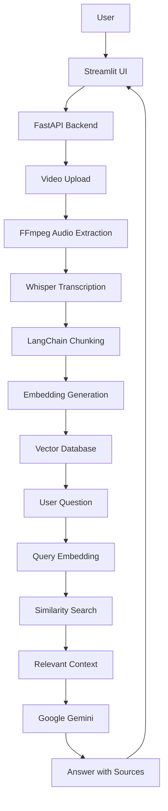

# 🎥 RAG AI Assistance – Video Question Answering System

An AI-powered **Retrieval-Augmented Generation (RAG)** application that allows users to upload multiple videos, extract their content, and ask questions based on the information available in those videos. The system retrieves relevant context and generates answers with video references and timestamps.

## 🚀 Features

* **Video Upload:** Upload videos in MP4, MOV, MKV, and AVI formats.
* **Audio Extraction:** Extract audio from videos using FFmpeg.
* **Speech-to-Text:** Convert audio into text with timestamps using OpenAI Whisper.
* **Text Chunking:** Split transcribed content into smaller chunks using LangChain.
* **Text Embeddings:** Generate vector embeddings for semantic search.
* **Vector Search:** Retrieve relevant content using similarity search and FAISS, when configured.
* **AI-Powered Answers:** Generate context-based answers using Google Gemini.
* **Timestamp References:** Identify relevant video segments to help users locate the source content.
* **FastAPI Backend:** Handle video uploads, processing, and question-answering requests.
* **Streamlit UI:** Provide a simple interface for uploading videos and interacting with the AI assistant.

## 🏗️ System Architecture



## 🛠️ Tech Stack

| Technology      | Purpose                         |
| --------------- | ------------------------------- |
| Python          | Core programming language       |
| FastAPI         | Backend REST API                |
| Streamlit       | User interface                  |
| FFmpeg          | Video-to-audio conversion       |
| OpenAI Whisper  | Speech-to-text transcription    |
| LangChain       | Text chunking                   |
| Embedding Model | Text vector generation          |
| FAISS           | Vector similarity search        |
| Google Gemini   | Context-based answer generation |
| Pydantic        | Request validation              |
| Python-dotenv   | Environment variable management |
| Uvicorn         | ASGI server                     |

## 📂 Project Structure

```text
RAG-AI-assistance/
│
├── app/
│   ├── main.py
│   └── services/
│
├── data/
│   ├── videos/
│   ├── audios/
│   ├── jsons/
│   └── faiss/
│
├── video_to_mp3.py
├── mp3_to_json.py
├── chunking.py
├── create_embeddings.py
├── retrieval.py
├── streamlit_app.py
│
├── requirements.txt
├── .env
├── .gitignore
└── README.md
```

*The directory structure may vary depending on the current implementation.*

## ⚙️ Installation and Setup

### 1. Clone the Repository

```bash
git clone https://github.com/Himanshubahetiya/RAG-AI-assistance.git
```

```bash
cd RAG-AI-assistance
```

### 2. Create a Virtual Environment

```bash
python -m venv venv
```

Activate the environment on Windows:

```powershell
venv\Scripts\activate
```

### 3. Install Dependencies

```bash
pip install -r requirements.txt
```

### 4. Install FFmpeg

FFmpeg is required to extract audio from video files.

Download FFmpeg from:

https://ffmpeg.org/download.html

Make sure FFmpeg is added to your system PATH and verify the installation:

```bash
ffmpeg -version
```

### 5. Configure Environment Variables

Create a `.env` file in the project root directory.

```env
GEMINI_API_KEY=your_gemini_api_key
```

Get your API key from:

https://aistudio.google.com/apikey

Never commit your `.env` file to GitHub.

## ▶️ Running the Application

The project uses FastAPI as the backend and Streamlit as the frontend.

### 1. Start the FastAPI Backend

If your FastAPI application is located in `app/main.py`:

```bash
uvicorn app.main:app --reload
```

If it is located in the root `main.py`:

```bash
uvicorn main:app --reload
```

Backend URL:

`http://127.0.0.1:8000`

FastAPI Swagger documentation:

`http://127.0.0.1:8000/docs`

### 2. Start the Streamlit Frontend

Open a separate terminal and run:

```bash
streamlit run streamlit_app.py
```

Frontend URL:

`http://localhost:8501`

## 🔄 Working Workflow

**Step 1: Upload Video**

The user uploads a video through the Streamlit interface. The frontend sends the file to the FastAPI `/upload-video` endpoint.

**Step 2: Audio Extraction**

FFmpeg extracts the audio from the uploaded video and converts it into MP3 format.

**Step 3: Transcription**

Whisper processes the extracted audio and converts speech into text segments with timestamps.

**Step 4: Text Chunking**

LangChain splits the transcribed text into smaller chunks to make retrieval more efficient while preserving the associated timestamps and video metadata.

**Step 5: Embedding Generation**

The system converts text chunks into numerical vector embeddings using the configured embedding model.

**Step 6: Vector Storage**

The generated embeddings and their metadata are stored in the configured vector database for semantic retrieval.

**Step 7: Question Processing**

The user submits a question through the Streamlit chat interface. The question is converted into an embedding using the compatible embedding model.

**Step 8: Similarity Search**

The system searches the vector database to retrieve the most relevant chunks related to the user's question.

**Step 9: Answer Generation**

The retrieved context is passed to Google Gemini to generate a response grounded in the available video content.

**Step 10: Display Results**

The final answer, along with available source video references and timestamps, is displayed in the Streamlit interface.

## 🔌 API Endpoints

| Method | Endpoint        | Description                                  |
| ------ | --------------- | -------------------------------------------- |
| GET    | `/`             | Check API status                             |
| POST   | `/upload-video` | Upload and process a video                   |
| POST   | `/ask`          | Ask a question about processed video content |

### Upload Video

**Endpoint:** `POST /upload-video`

Request: `multipart/form-data`

Parameter: `file` — Video file (MP4, MOV, MKV, AVI)

Example response:

```json
{
  "message": "Video uploaded and processed successfully",
  "filename": "sample.mp4",
  "total_embeddings": 120
}
```

### Ask a Question

**Endpoint:** `POST /ask`

Request:

```json
{
  "question": "What is artificial intelligence?"
}
```

The response contains the generated answer and may include relevant source information and timestamps, depending on the retrieval response structure.

## 🔐 Environment Variables

| Variable         | Description           |
| ---------------- | --------------------- |
| `GEMINI_API_KEY` | Google Gemini API key |

Keep all sensitive credentials in environment variables and never expose them in source code.

## 📌 Requirements

* Python 3.10+
* FFmpeg
* Google Gemini API key
* Required Python packages from `requirements.txt`
* Sufficient RAM and disk space for video processing and model inference

## 🔮 Future Improvements

* Background video processing with real-time progress tracking.
* Support for larger video files and additional formats.
* Improved retrieval accuracy with optimized chunking and embedding strategies.
* Video playback directly from relevant timestamps.
* Authentication and user-specific video libraries.
* Docker-based deployment.
* Cloud storage and scalable vector database integration.

## 👨‍💻 Author

**Himanshu Bahetiya**

Python Developer | AI/ML Engineer

* GitHub: https://github.com/Himanshubahetiya
* Project: https://github.com/Himanshubahetiya/RAG-AI-assistance

---

⭐ If you find this project useful, consider giving it a star on GitHub.
=======
Step 5 = prompt generation and feed it to an LLM
Read the joblib file and load it in the memory, then create a relevant prompt as per the user query and feed it to the LLM

uvicorn app.main:app --reload
streamlit run streamlit_app.py
